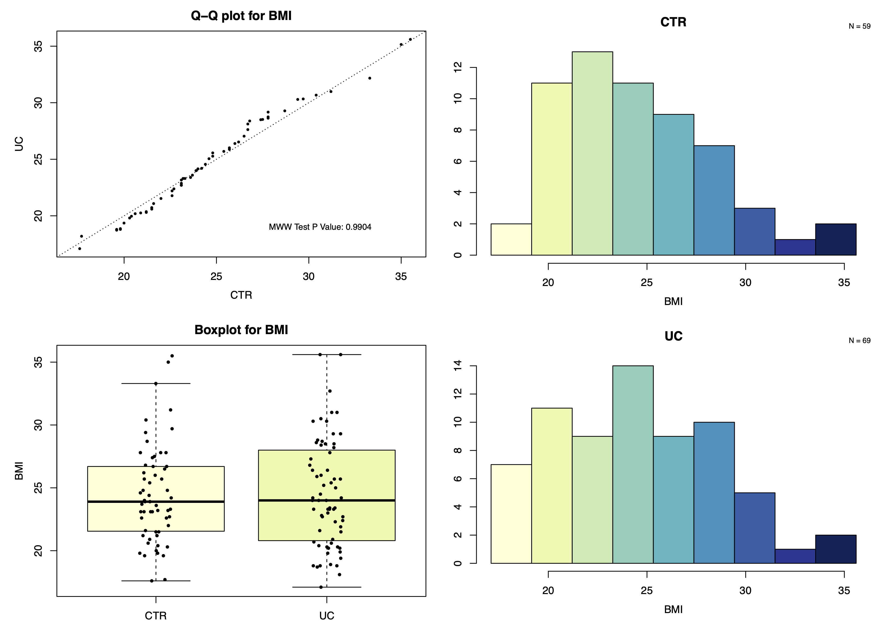
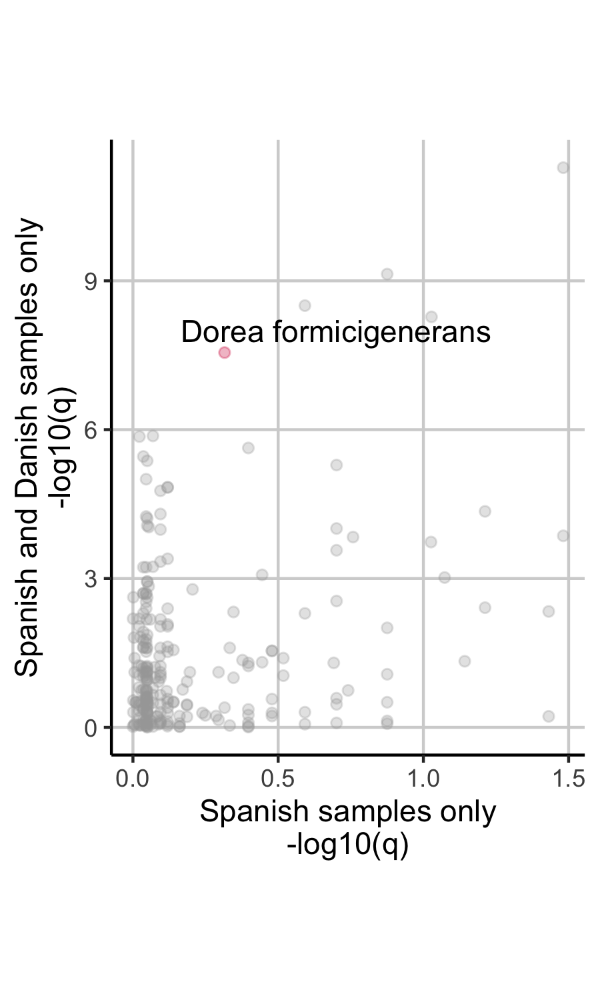

```r
library("tidyverse")
library("SIAMCAT")
library("curatedMetagenomicData")
library("ggpubr")
```


# Standard Workflow

Here, we demonstrate the standard workflow of the `SIAMCAT` package using as
an example the dataset from
[Nielsen et al. _Nat Biotechnol_ 2014](https://www.ncbi.nlm.nih.gov/pubmed/24997787).
This dataset contains samples from patients with inflammatory bowel disease and
from controls.

Running the standard `SIAMCAT` pipeline, we produce the primary outputs of the
package, namely the

* Association plot
* Confounder plots
* Model evaluation plot
* Model interpretation plot

## Loading the data

The taxonomic abundance profiles and the sample meatadata for the example
dataset are available through the `curatedMetagenomicsData` R package.

### Metadata


```r
meta.nielsen.full <- combined_metadata %>%
  filter(dataset_name=='NielsenHB_2014')
```

However, we have to clean the data a bit, since the data set contains samples
from two different countries (see below for the [Confounder Analyses](#confounder_analyses)) and
from two different disease subtypes.


```r
table(meta.nielsen.full$country)
##
## DNK ESP
## 177 219
table(meta.nielsen.full$disease, meta.nielsen.full$disease_subtype)
##          
##            CD  UC
##   healthy   0   0
##   IBD      21 127
```


Also, we have an additional problem, because we have more samples than
individual subjects:


```r
print(length(unique(meta.nielsen.full$subjectID)))
## [1] 318
print(nrow(meta.nielsen.full))
## [1] 396
```

Some subjects (but not all) had been sampled multiple times.
Therefore, we want to remove repeated samplings for the same subject, since
the samples would otherwise not be indepdenent from another (see also
**Figure 4** in the main manuscript).


The visit number is encoded in the `sampleID`. Therefore, we can use this
information to extract when the samples have been taken and use only the
first visit for each subject.


```r
meta.nielsen <- meta.nielsen.full %>%
  select(sampleID, subjectID, study_condition, disease_subtype,
         disease, age, country, number_reads, median_read_length, BMI) %>%
  mutate(visit=str_extract(sampleID, '_[0-9]+$')) %>%
  mutate(visit=str_remove(visit, '_')) %>%
  mutate(visit=as.numeric(visit)) %>%
  mutate(visit=case_when(is.na(visit)~0, TRUE~visit)) %>%
  group_by(subjectID) %>%
  filter(visit==min(visit)) %>%
  ungroup() %>%
  mutate(Sample_ID=sampleID) %>%
  mutate(Group=case_when(disease=='healthy'~'CTR',
                         TRUE~disease_subtype))
```

Also, we want to restrict the dataset to Spanish samples only and to
control samples and ulcerative colitis samples only. Additionally, we transform
the metadata (which are stored as a `tibble` for easier handling) into a
dataframe to hand it over to `SIAMCAT`.


```r
meta.nielsen.uc <- meta.nielsen %>%
  filter(Group %in% c('CTR', 'UC')) %>%
  filter(country == 'ESP') %>%
  as.data.frame()
rownames(meta.nielsen.uc) <- meta.nielsen.uc$sampleID
meta.nielsen.uc$sampleID <- NULL
```

### Taxonomic profiles

We can load the taxonomic profiles generated with MetaPhlAn2 via the
_curatedMetagenomicsData_ R package.


```r
x <- 'NielsenHB_2014.metaphlan_bugs_list.stool'
feat <- curatedMetagenomicData(x=x, dryrun=FALSE)
## Working on NielsenHB_2014.metaphlan_bugs_list.stool
## snapshotDate(): 2019-04-29
## see ?curatedMetagenomicData and browseVignettes('curatedMetagenomicData') for documentation
## downloading 0 resources
## loading from cache
##     'EH1290 : 1290'
feat <- feat[[x]]@assayData$exprs
```

The MetaPhlAn2 profiles contain information on different taxonomic levels.
Therefore, we want to restrict them to species-level profiles. In a second step,
we convert them into relative abundances (summing up to 1) instead of using
the percentages (summing up to 100) that MetaPhlAn2 outputs.


```r
feat <- feat[grep(x=rownames(feat), pattern='s__'),]
feat <- feat[grep(x=rownames(feat),pattern='t__', invert = TRUE),]
feat <- t(t(feat)/100)
```

The feature names are very long and may be a bit un-wieldy for plotting later
on, so we shorten them to only the species name:


```r
rownames(feat) <- str_extract(rownames(feat), 's__.*$')
```

### The SIAMCAT object

Now, we have everything ready to create a `SIAMCAT` object which stores
the feature matrix, the meta-variables, and the label. Here, the label is
created using the information in the metadata.


```r
sc.obj <- siamcat(feat=feat, meta=meta.nielsen.uc, label='Group', case='UC')
## + starting create.label
## Label used as case:
##    UC
## Label used as control:
##    CTR
## + finished create.label.from.metadata in 0.02 s
## + starting validate.data
## +++ checking overlap between labels and features
## + Keeping labels of 128 sample(s).
## +++ checking sample number per class
## +++ checking overlap between samples and metadata
## + finished validate.data in 0.353 s
```

### Feature filtering

Now, we can filter feature with low overall abundance and prevalence.

```r
sc.obj <- filter.features(sc.obj, cutoff=1e-04,
                          filter.method = 'abundance')
## Features successfully filtered
sc.obj <- filter.features(sc.obj, cutoff=0.05,
                          filter.method='prevalence',
                          feature.type = 'filtered')
## Features successfully filtered
```


## Association plot

The `check.assocation` function calculates the significance of enrichment and
metrics of association (such as generalized fold change and single-feautre
AUROC).


```r
sc.obj <- check.associations(sc.obj, detect.lim = 1e-06,
                             alpha=0.1, max.show = 20,
                             plot.type = 'quantile.rect',
                             fn.plot = './association_plot.pdf')
## Plotted associations between features and label successfully to: ./association_plot.pdf
```


## Confounder analysis

We can also check the supplied meta-variables for potential confounding.


```r
check.confounders(sc.obj, fn.plot = './confounders.pdf')
## ++ metadata variables:
## 	study_condition & disease_subtype & disease
## ++ are nested inside the label and have been removed from this analysis
## ++ remove metadata variables, since all subjects have the same value
## 	country
## Finished checking metadata for confounders, results plotted to: ./confounders.pdf
```



The function produces one plot for each meta-variable. Here, we show only the
example of the body mass index (BMI). The BMI distributions look very similar
for both controls and UC cases, so it is unlikely that the BMI would
confound the analyses.

## Machine learning workflow

The machine learning workflow can be easily implemented in `SIAMCAT`. It
contains the following steps:

* Feature normalization
* Data splitting for cross-validation
* Model training
* Making model predictions (on left-out data)
* Evaluating model predictions (using AUROC and AUPRC)


```r
sc.obj <- normalize.features(sc.obj, norm.method = 'log.std',
                             norm.param = list(log.n0=1e-06, sd.min.q=0))
## Features normalized successfully.
sc.obj <- create.data.split(sc.obj, num.folds = 10, num.resample = 10)
## Features splitted for cross-validation successfully.
sc.obj <- train.model(sc.obj, method='lasso')
## Trained lasso models successfully.
sc.obj <- make.predictions(sc.obj)
## Made predictions successfully.
sc.obj <- evaluate.predictions(sc.obj)
## Evaluated predictions successfully.
```

## Model evaluation plot

The model evaluation plot will produce one plot with the ROC curve and another
one with the precision-recall curve (not shown here).


```r
model.evaluation.plot(sc.obj, fn.plot = './eval_plot.pdf')
## Plotted evaluation of predictions successfully to: ./eval_plot.pdf
```


## Model interpretation plot

The model interpretation plot can give you additional information about the
trained machine learning model. It will show you:

* the feature importance as barplot,
* the feature robustness (in how many of the models in the repeated
cross-validation this feature has been selected into the model),
* the normalized feature abundances across samples as heatmap,
* the optional metadata as heatmap below, and
* a boxplot showing the proportion of the model weight that is explained by  
the selected features.


```r
model.interpretation.plot(sc.obj, consens.thres = 0.8,
                          fn.plot = './interpretation.pdf')
## Successfully plotted model interpretation plot to: ./interpretation.pdf
```


# Confounder Analyses

As already mentioned above, the Nielsen dataset contains samples from both
Spain and Denmark. Let us see what the result would be if we had not removed
them.

## Where are you from?

First, we create a `SIAMCAT` object again, this time including the
Danish controls:


```r
meta.nielsen.uc.dnk <- meta.nielsen %>%
  filter(Group %in% c('CTR', 'UC')) %>%
  # filter(country == 'ESP') %>% # this time we do not remove Danish samples
  as.data.frame()
rownames(meta.nielsen.uc.dnk) <- meta.nielsen.uc.dnk$sampleID
meta.nielsen.uc.dnk$sampleID <- NULL

sc.obj.dnk <- siamcat(feat=feat, meta=meta.nielsen.uc.dnk,
                      label='Group', case='UC')
## + starting create.label
## Label used as case:
##    UC
## Label used as control:
##    CTR
## + finished create.label.from.metadata in 0.003 s
## + starting validate.data
## +++ checking overlap between labels and features
## + Keeping labels of 305 sample(s).
## +++ checking sample number per class
## +++ checking overlap between samples and metadata
## + finished validate.data in 0.042 s
sc.obj.dnk <- filter.features(sc.obj.dnk, cutoff=1e-04,
                              filter.method = 'abundance')
## Features successfully filtered
sc.obj.dnk <- filter.features(sc.obj.dnk, cutoff=0.05,
                              filter.method='prevalence',
                              feature.type = 'filtered')
## Features successfully filtered
```

The confounder plot would show us that the meta-variable "country" might be
problematic:

```r
check.confounders(sc.obj.dnk, fn.plot = './confounders_dnk.pdf')
```


## Assocations testing

First, we can use `SIAMCAT` to test for associations:


```r
sc.obj.dnk <- check.associations(sc.obj.dnk, detect.lim = 1e-06,
                                 alpha=0.1, max.show = 20,
                                 plot.type = 'quantile.rect',
                                 fn.plot = './association_plot_dnk.pdf')
## Plotted associations between features and label successfully to: ./association_plot_dnk.pdf
```

Confounders can lead to biases in association testing. After using `SIAMCAT` to
test for associations in both datasets (one time including the Danish samples,
the other time restricted to samples from Spain only), we can extract the
association metrics from both `SIAMCAT` objects and compare them in a
scatter plot.


```r
assoc.sp <- associations(sc.obj)
assoc.sp$species <- rownames(assoc.sp)
assoc.sp_dnk <- associations(sc.obj.dnk)
assoc.sp_dnk$species <- rownames(assoc.sp_dnk)

df.plot <- full_join(assoc.sp, assoc.sp_dnk, by='species')
df.plot %>%
  mutate(highlight=str_detect(species, 'Dorea_formicigenerans')) %>%
  ggplot(aes(x=-log10(p.adj.x), y=-log10(p.adj.y), col=highlight)) +
    geom_point(alpha=0.3) +
    xlab('Spanish samples only\n-log10(q)') +
    ylab('Spanish and Danish samples only\n-log10(q)') +
    theme_classic() +
    theme(panel.grid.major = element_line(colour='lightgrey'),
          aspect.ratio = 1.3) +
    scale_colour_manual(values=c('darkgrey', '#D41645'), guide=FALSE) +
    annotate('text', x=0.7, y=8, label='Dorea formicigenerans')
```




This result shows that several species are only signficant if the Danish
control samples are included, but not when considering only the Spanish samples.

As an example, we highlighted the species _"Dorea formicigenerans"_ in the plot
above. The test is not significant in the Spanish cohort, but is highly
significant when the Danish samples are included.


```r
# extract information out of the siamcat object
feat.dnk <- get.filt_feat.matrix(sc.obj.dnk)
label.dnk <- label(sc.obj.dnk)$label
country <- meta(sc.obj.dnk)$country
names(country) <- rownames(meta(sc.obj.dnk))

df.plot <- tibble(dorea=log10(feat.dnk['s__Dorea_formicigenerans',
                                       names(label.dnk)] + 1e-05),
                  label=label.dnk, country=country) %>%
  mutate(label=case_when(label=='-1'~'CTR', TRUE~"UC")) %>%
  mutate(x_value=paste0(country, '_', label))

df.plot %>%
  ggplot(aes(x=x_value, y=dorea)) +
    geom_boxplot(outlier.shape = NA) +
    geom_jitter(width = 0.08, stroke=0, alpha=0.2) +
    theme_classic() +
    xlab('') +
    ylab("log10(Dorea_formicigenerans)") +
    stat_compare_means(comparisons = list(c('DNK_CTR', 'ESP_CTR'),
                                          c('DNK_CTR', 'ESP_UC'),
                                          c('ESP_CTR', 'ESP_UC'))) +
    theme(aspect.ratio = 1.3)
```


## Machine learning

The results from the machine learning workflows can also be biased by the
differences between countries, leading to exaggerated performance estimates.


```r
sc.obj.dnk <- normalize.features(sc.obj.dnk, norm.method = 'log.std',
                                 norm.param = list(log.n0=1e-06, sd.min.q=0))
## Features normalized successfully.
sc.obj.dnk <- create.data.split(sc.obj.dnk, num.folds = 10, num.resample = 10)
## Features splitted for cross-validation successfully.
sc.obj.dnk <- train.model(sc.obj.dnk, method='lasso')
## Trained lasso models successfully.
sc.obj.dnk <- make.predictions(sc.obj.dnk)
## Made predictions successfully.
sc.obj.dnk <- evaluate.predictions(sc.obj.dnk)
## Evaluated predictions successfully.
```

When we compare the performance of the two different models, the model with the
Danish and Spanish samples included seems to perform better (higher AUROC
value). However, the previous analysis suggests that this performance estimate
is biased and exaggerated because differences between Spanish and Danish
samples can be very large.


```r
model.evaluation.plot("Spanish samples only"=sc.obj,
                      "Danish and Spanish samples"=sc.obj.dnk,
                      fn.plot = './eval_plot_dnk.pdf')
## Plotted evaluation of predictions successfully to: ./eval_plot_dnk.pdf
```


To demonstrate how machine learning models can exloit this confounding factor,
we can train a model to distinguish between Spanish and Danish control samples.
As you can see, the model can distinguish between the two countries with
almost perfect accuracy.


```r
meta.nielsen.country <- meta.nielsen %>%
  filter(Group %in% c('CTR')) %>% # only control samples
  # filter(country == 'ESP') %>% # this time we do not remove Danish samples
  as.data.frame()
rownames(meta.nielsen.country) <- meta.nielsen.country$sampleID
meta.nielsen.country$sampleID <- NULL

sc.obj.country <- siamcat(feat=feat, meta=meta.nielsen.country,
                          label='country', case='ESP')
## + starting create.label
## Label used as case:
##    ESP
## Label used as control:
##    DNK
## + finished create.label.from.metadata in 0.004 s
## + starting validate.data
## +++ checking overlap between labels and features
## + Keeping labels of 236 sample(s).
## +++ checking sample number per class
## +++ checking overlap between samples and metadata
## + finished validate.data in 0.045 s
sc.obj.country <- filter.features(sc.obj.country, cutoff=1e-04,
                              filter.method = 'abundance')
## Features successfully filtered
sc.obj.country <- filter.features(sc.obj.country, cutoff=0.05,
                              filter.method='prevalence',
                              feature.type = 'filtered')
## Features successfully filtered
sc.obj.country <- normalize.features(sc.obj.country, norm.method = 'log.std',
                                     norm.param = list(log.n0=1e-06,
                                                       sd.min.q=0))
## Features normalized successfully.
sc.obj.country <- create.data.split(sc.obj.country,
                                    num.folds = 10, num.resample = 10)
## Features splitted for cross-validation successfully.
sc.obj.country <- train.model(sc.obj.country, method='lasso')
## Trained lasso models successfully.
sc.obj.country <- make.predictions(sc.obj.country)
## Made predictions successfully.
sc.obj.country <- evaluate.predictions(sc.obj.country)
## Evaluated predictions successfully.

model.evaluation.plot(sc.obj.country, fn.plot = './eval_plot_country.pdf')
## Plotted evaluation of predictions successfully to: ./eval_plot_country.pdf
```


# Session Info


```r
sessionInfo()
## R version 3.6.1 (2019-07-05)
## Platform: x86_64-apple-darwin15.6.0 (64-bit)
## Running under: macOS Catalina 10.15.2
##
## Matrix products: default
## BLAS:   /Library/Frameworks/R.framework/Versions/3.6/Resources/lib/libRblas.0.dylib
## LAPACK: /Library/Frameworks/R.framework/Versions/3.6/Resources/lib/libRlapack.dylib
##
## locale:
## [1] en_US.UTF-8/en_US.UTF-8/en_US.UTF-8/C/en_US.UTF-8/en_US.UTF-8
##
## attached base packages:
## [1] parallel  stats     graphics  grDevices utils     datasets  methods  
## [8] base     
##
## other attached packages:
##  [1] ggpubr_0.2.3                  magrittr_1.5                 
##  [3] curatedMetagenomicData_1.14.1 ExperimentHub_1.10.0         
##  [5] Biobase_2.44.0                AnnotationHub_2.16.1         
##  [7] BiocFileCache_1.8.0           dbplyr_1.4.2                 
##  [9] BiocGenerics_0.30.0           SIAMCAT_1.5.1                
## [11] phyloseq_1.28.0               mlr_2.15.0                   
## [13] ParamHelpers_1.12             forcats_0.4.0                
## [15] stringr_1.4.0                 dplyr_0.8.3                  
## [17] purrr_0.3.3                   readr_1.3.1                  
## [19] tidyr_1.0.0                   tibble_2.1.3                 
## [21] ggplot2_3.2.1                 tidyverse_1.2.1              
##
## loaded via a namespace (and not attached):
##   [1] colorspace_1.4-1              ggsignif_0.6.0               
##   [3] XVector_0.24.0                rstudioapi_0.10              
##   [5] bit64_0.9-7                   AnnotationDbi_1.46.1         
##   [7] interactiveDisplayBase_1.22.0 lubridate_1.7.4              
##   [9] xml2_1.2.2                    codetools_0.2-16             
##  [11] splines_3.6.1                 PRROC_1.3.1                  
##  [13] knitr_1.25                    zeallot_0.1.0                
##  [15] ade4_1.7-13                   jsonlite_1.6                 
##  [17] pROC_1.15.3                   broom_0.5.2                  
##  [19] gridBase_0.4-7                cluster_2.1.0                
##  [21] shiny_1.4.0                   BiocManager_1.30.9           
##  [23] compiler_3.6.1                httr_1.4.1                   
##  [25] backports_1.1.5               fastmap_1.0.1                
##  [27] assertthat_0.2.1              Matrix_1.2-17                
##  [29] lazyeval_0.2.2                cli_1.1.0                    
##  [31] later_1.0.0                   htmltools_0.4.0              
##  [33] prettyunits_1.0.2             tools_3.6.1                  
##  [35] igraph_1.2.4.1                gtable_0.3.0                 
##  [37] glue_1.3.1                    reshape2_1.4.3               
##  [39] LiblineaR_2.10-8              rappdirs_0.3.1               
##  [41] fastmatch_1.1-0               Rcpp_1.0.2                   
##  [43] parallelMap_1.4               cellranger_1.1.0             
##  [45] vctrs_0.2.0                   Biostrings_2.52.0            
##  [47] multtest_2.40.0               ape_5.3                      
##  [49] nlme_3.1-141                  iterators_1.0.12             
##  [51] xfun_0.10                     rvest_0.3.4                  
##  [53] mime_0.7                      lifecycle_0.1.0              
##  [55] XML_3.98-1.20                 beanplot_1.2                 
##  [57] zlibbioc_1.30.0               MASS_7.3-51.4                
##  [59] scales_1.0.0                  promises_1.1.0               
##  [61] hms_0.5.1                     biomformat_1.12.0            
##  [63] rhdf5_2.28.1                  RColorBrewer_1.1-2           
##  [65] BBmisc_1.11                   curl_4.2                     
##  [67] yaml_2.2.0                    memoise_1.1.0                
##  [69] gridExtra_2.3                 stringi_1.4.3                
##  [71] RSQLite_2.1.2                 S4Vectors_0.22.1             
##  [73] corrplot_0.84                 foreach_1.4.7                
##  [75] checkmate_1.9.4               permute_0.9-5                
##  [77] rlang_0.4.0                   pkgconfig_2.0.3              
##  [79] matrixStats_0.55.0            evaluate_0.14                
##  [81] lattice_0.20-38               Rhdf5lib_1.6.3               
##  [83] labeling_0.3                  bit_1.1-14                   
##  [85] tidyselect_0.2.5              plyr_1.8.4                   
##  [87] R6_2.4.0                      IRanges_2.18.3               
##  [89] generics_0.0.2                DBI_1.0.0                    
##  [91] pillar_1.4.2                  haven_2.1.1                  
##  [93] withr_2.1.2                   mgcv_1.8-29                  
##  [95] survival_2.44-1.1             modelr_0.1.5                 
##  [97] crayon_1.3.4                  rmarkdown_1.16               
##  [99] progress_1.2.2                grid_3.6.1                   
## [101] readxl_1.3.1                  data.table_1.12.6            
## [103] blob_1.2.0                    vegan_2.5-6                  
## [105] infotheo_1.2.0                digest_0.6.22                
## [107] xtable_1.8-4                  httpuv_1.5.2                 
## [109] stats4_3.6.1                  munsell_0.5.0                
## [111] glmnet_2.0-18
```
